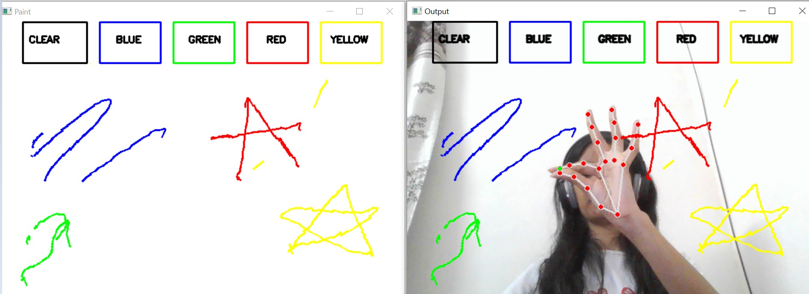

# CanvasAI: Drawing with Hand Gestures 🌈✋
---
## Overview
CanvasAI is a simple and fun computer vision project that allows you to draw in the air using hand gestures. Built with OpenCV and machine learning using Mediapipe, this project detects and tracks hand landmarks to create an interactive canvas.

## Features
- **Gesture-Based Drawing:** Express your creativity by waving your hand in the air to draw.
- **Color Palette:** Choose from a variety of colors, including blue, green, red, and yellow.
- **Clear Canvas:** Easily wipe the canvas clean.

## Demo Output

<p align="center">

</p>


## Implementation Details:

### Requirements:

- Python
- OpenCV
- NumPy
- Mediapipe

### Installation:
- Clone this repository to your local machine.

- Install Dependencies and Setup :
  
  Install using requirements file provided -
  ```
  pip install -r requirements.txt
  ```

- Run the script and start waving your hand to bring your imagination to life on the Air Canvas!

## Algorithmic Breakdown

- Importing Libraries: Import essential libraries- OpenCV, NumPy, MediaPipe, and deque from collections.

- Initializing Color Arrays and Indices: Initialize arrays and indices for different color points (blue, green, red, yellow).

- Creating Dilation Kernel and Color Information:
1. Create a dilation kernel using NumPy.
2. Define colors and indices for drawing lines.

- Setting up the Canvas:
1. Initialize a blank canvas using NumPy.
2. Draw rectangles and labels for different colors on the canvas.

- Initializing MediaPipe and Webcam:
1. Initialize MediaPipe Hands for hand tracking.
2. Initialize webcam capture using OpenCV.

- Main Loop:
1. Read frames from the webcam, flip vertically, and convert colors from BGR to RGB.
2. Process hand landmark predictions from MediaPipe.
3. Identify fingertip positions and handle specific conditions for drawing and interaction.
4. Draw lines on the frame and canvas for each color.

- Display and Interaction:
1. Display the frame and painting window.
2. Exit the loop if the 'q' key is pressed.

- Cleanup: Release the webcam and close all active windows.

---

Feel free to contribute, report issues, or suggest improvements!🎨✨
